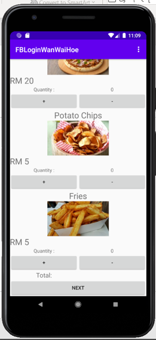

# Java Restaurant System

This is a simple **Restaurant System** developed in Java using Android Studio as part of my student project.  
The app is designed to simulate a restaurant ordering system, allowing user to log in with their facebook account,
browse menus, apply coupon, and place orders for either delivery or carry-out.

## Features

- **Facebook Login**: Login using a Facebook account
- **Menu Browsing**: View menu pages with available food items
- **Coupon Discounts**: Apply coupon to received discount
- **Order Options**: Choose between delivery or carry-out
- **Real-time Price Calculation**: Automatically updates the total price based on selected items and options

## Technologies Used

- Java (Android Studio)
- Object-Oriented Programming (OOP)
- Firebase (Facebook Login integration)

## Screenshots

- **Menu Page**

    
    
    
  

- **Check out Page**

  

- **Facebook Login**

    
    
  

- **About page to show simple information**

  
